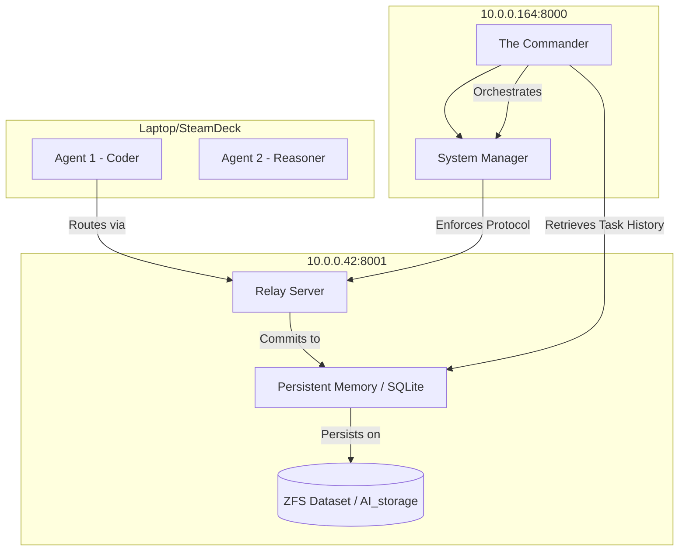

# The-Commander: AI Agent Operating System

**The-Commander** is a distributed orchestrator for managing a cluster of heterogeneous AI agents. It centralizes state, memory, and task lifecycle management while allowing decentralized execution across specific compute nodes.

---

## **Architectural Topology & Performance**

The system is designed for a multi-node worker topology with a central storage and relay authority. Compute is weighted towards the high-performance Main and HTPC nodes.

| Node | Network Address | Hardware | Benchmark (t/s) | Description |
|------|-----------------|----------|-----------------|-------------|
| **Main** | `http://10.0.0.164:8000/` | Radeon 7900XTX | **130** | Orchestrator (The Commander) + Heart of Compute. |
| **HTPC** | `http://10.0.0.42:8001/` | Radeon 7600 | **60** | Central storage auth + Message Relay hub. |
| **SteamDeck** | `http://10.0.0.139:8003/` | Custom APU | **30** | Tertiary Worker (Light Jobs). |
| **Laptop** | `http://10.0.0.93:8002/` | Integrated | **9** | Tertiary Worker (Minimal Load). |

### **Authoritative Storage (ZFS)**
The **Gillsystems-HTPC** node (`gillsystems-htpc`) hosts the only dataset used by the system:
- **Mountpoint:** `/gillsystems_zfs_pool/AI_storage`
- **Installation Root:** `/home/gillsystems-htpc/`

---

## **The Commander Protocol Layer**

Communication within the cluster is governed by the **Commander Protocol**, a strict message/task envelope system that prevents architectural drift.

- **The Commander:** The authoritative initializer and orchestrator meta-agent (Priority 0).
- **Hierarchy:** Commander -> Architect -> Coder/Reasoner -> Synthesizer.
- **Protocol Envelopes:** Every message is wrapped in a `MessageEnvelope` (UUID, Timestamp, Sender/Recipient, Task ID, Priority, Payload).

---

## **Extensible Memory System**

The-Commander utilizes an extensible persistent memory system backed by SQLite via SQLAlchemy.

- **Flexibility:** The schema includes a `metadata_json` column for storing arbitrary agent state or task context.
- **Efficiency:** Message content is GZIP compressed at rest.
- **Searchable:** Full indices on Task ID, Sender, and Content Hash (SHA-256).

---

## **Flow Diagram**



---

## **Quick Start**

1. **Bootstrap Core Managers:**
   ```bash
   # System starts by loading relay.yaml/roles.yaml from HTPC root
   uvicorn commander_os.interfaces.rest_api:app --port 8000
   ```
2. **Execute Tests:**
   ```bash
   python -m pytest tests/ -v
   ```

*Property of Gillsystems. Alignment is Mandatory.*
